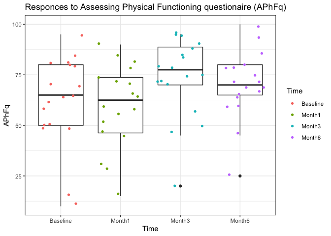
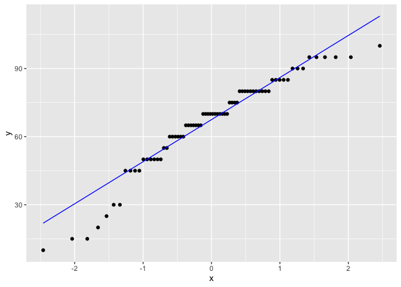
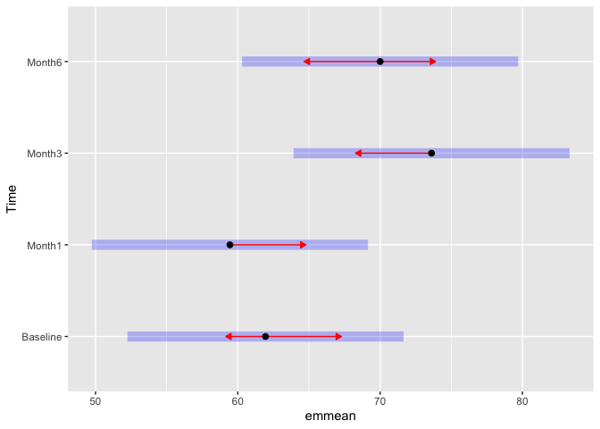

Repeated Measures ANOVA
================

# Example from the Chaper 8 Daniel

Licciardone et al. examined subjects with chronic, nonspecific low back
pain. In this study, 18 of the subjects completed a survey questionnaire
assessing physical functioning at baseline, and after 1, 3, and 6
months. File EXA\_C08\_S04\_01.csv includes the data for these subjects
who received a sham treatment that appeared to be genuine osteopathic
manipulation. Higher values indicate better physical functioning. The
goal of the experiment was to determine if subjects would report
improvement over time even though the treatment they received would
provide minimal improvement. We wish to know if there is a difference in
the mean survey values among the four points in time.

## Data wrangling

Loading the dataset we notice that it is in table format and need to be
changed to ‘longer’ format using the `pivot_longer` and selecting the
variables and setting the subject lavel appart, since the subject lavel
is used for the repeated measures ANOVA

``` r
library(tidyverse)
```

    ## ── Attaching packages ─────────────────────────────────────── tidyverse 1.3.1 ──

    ## ✓ ggplot2 3.3.5     ✓ purrr   0.3.4
    ## ✓ tibble  3.1.3     ✓ dplyr   1.0.7
    ## ✓ tidyr   1.1.3     ✓ stringr 1.4.0
    ## ✓ readr   2.0.1     ✓ forcats 0.5.1

    ## ── Conflicts ────────────────────────────────────────── tidyverse_conflicts() ──
    ## x dplyr::filter() masks stats::filter()
    ## x dplyr::lag()    masks stats::lag()

``` r
#
chronPain <- read_csv("~/Dropbox/GitHub/ProbEstad/DataSets/ch08_all/EXA_C08_S04_01.csv", col_names = TRUE, show_col_types = FALSE)

chronPain_long <- chronPain %>%
  pivot_longer(cols = Baseline:Month6, names_to = "Time", values_to = "APhFq")

chronPain_long
```

    ## # A tibble: 72 × 3
    ##    Subject Time     APhFq
    ##      <dbl> <chr>    <dbl>
    ##  1       1 Baseline    80
    ##  2       1 Month1      60
    ##  3       1 Month3      95
    ##  4       1 Month6     100
    ##  5       2 Baseline    95
    ##  6       2 Month1      90
    ##  7       2 Month3      95
    ##  8       2 Month6      95
    ##  9       3 Baseline    65
    ## 10       3 Month1      55
    ## # … with 62 more rows

``` r
chronPain_long <- chronPain_long %>%
  mutate( Subject = factor(Subject), Time = factor(Time) )

chronPain_long <- chronPain_long %>%
  mutate( Time = Time %>% fct_relevel("Baseline","Month1","Month3","Month6") )

# A boxplot
chronPain_long %>% ggplot(aes(x = Time, y = APhFq)) +
    geom_boxplot() +
    geom_jitter(aes(colour = Time), shape = 16, position = position_jitter(seed = 123)) +
    labs(title = "Responces to Assessing Physical Functioning questionaire (APhFq)") +
    theme_bw()
```

<!-- -->

## Now the repated Measures ANOVA model

We will estimate the model with the base library `aov()` function and
the anova function of `rstatix` library

``` r
#
# first load the missing libraries
library(car)
```

    ## Loading required package: carData

    ## 
    ## Attaching package: 'car'

    ## The following object is masked from 'package:dplyr':
    ## 
    ##     recode

    ## The following object is masked from 'package:purrr':
    ## 
    ##     some

``` r
library(emmeans)
library(rstatix)
```

    ## 
    ## Attaching package: 'rstatix'

    ## The following object is masked from 'package:stats':
    ## 
    ##     filter

``` r
# Testing for outliers
chronPain_long %>% 
  group_by(Time) %>% 
  identify_outliers(APhFq)
```

    ## # A tibble: 2 × 5
    ##   Time   Subject APhFq is.outlier is.extreme
    ##   <fct>  <fct>   <dbl> <lgl>      <lgl>     
    ## 1 Month3 16         20 TRUE       FALSE     
    ## 2 Month6 16         25 TRUE       FALSE

``` r
# Test normal distribution
chronPain_long %>% 
  group_by(Time) %>% 
  shapiro_test(APhFq)
```

    ## # A tibble: 4 × 4
    ##   Time     variable statistic      p
    ##   <fct>    <chr>        <dbl>  <dbl>
    ## 1 Baseline APhFq        0.900 0.0568
    ## 2 Month1   APhFq        0.960 0.611 
    ## 3 Month3   APhFq        0.884 0.0303
    ## 4 Month6   APhFq        0.935 0.235

``` r
chronPain_long %>% 
  group_by(Time) %>% 
  ggplot(aes(sample = APhFq)) +
  geom_qq() +
  geom_qq_line(color = "blue")
```

<!-- -->

``` r
# With the aov R function
(chronPain_long_aov <- aov( APhFq ~ Time + Error(Subject/Time), data = chronPain_long ))
```

    ## 
    ## Call:
    ## aov(formula = APhFq ~ Time + Error(Subject/Time), data = chronPain_long)
    ## 
    ## Grand Mean: 66.25
    ## 
    ## Stratum 1: Subject
    ## 
    ## Terms:
    ##                 Residuals
    ## Sum of Squares    20237.5
    ## Deg. of Freedom        17
    ## 
    ## Residual standard error: 34.50277
    ## 
    ## Stratum 2: Subject:Time
    ## 
    ## Terms:
    ##                     Time Residuals
    ## Sum of Squares  2395.833  7404.167
    ## Deg. of Freedom        3        51
    ## 
    ## Residual standard error: 12.04906
    ## Estimated effects may be unbalanced

``` r
#
anova_summary(chronPain_long_aov)
```

    ##   Effect DFn DFd     F     p p<.05   ges
    ## 1   Time   3  51 5.501 0.002     * 0.244

``` r
summary(chronPain_long_aov)
```

    ## 
    ## Error: Subject
    ##           Df Sum Sq Mean Sq F value Pr(>F)
    ## Residuals 17  20238    1190               
    ## 
    ## Error: Subject:Time
    ##           Df Sum Sq Mean Sq F value  Pr(>F)   
    ## Time       3   2396   798.6   5.501 0.00237 **
    ## Residuals 51   7404   145.2                   
    ## ---
    ## Signif. codes:  0 '***' 0.001 '**' 0.01 '*' 0.05 '.' 0.1 ' ' 1

``` r
# To estimate the pairwise post hoc
emm_aov <- emmeans(chronPain_long_aov, ~ Time)
```

    ## Note: re-fitting model with sum-to-zero contrasts

``` r
pairs(emm_aov)
```

    ##  contrast          estimate   SE df t.ratio p.value
    ##  Baseline - Month1     2.50 4.02 51   0.622  0.9244
    ##  Baseline - Month3   -11.67 4.02 51  -2.905  0.0269
    ##  Baseline - Month6    -8.06 4.02 51  -2.006  0.1994
    ##  Month1 - Month3     -14.17 4.02 51  -3.527  0.0048
    ##  Month1 - Month6     -10.56 4.02 51  -2.628  0.0534
    ##  Month3 - Month6       3.61 4.02 51   0.899  0.8053
    ## 
    ## P value adjustment: tukey method for comparing a family of 4 estimates

``` r
pwpm(emm_aov)
```

    ##          Baseline Month1 Month3 Month6
    ## Baseline   [61.9] 0.9244 0.0269 0.1994
    ## Month1       2.50 [59.4] 0.0048 0.0534
    ## Month3     -11.67 -14.17 [73.6] 0.8053
    ## Month6      -8.06 -10.56   3.61 [70.0]
    ## 
    ## Row and column labels: Time
    ## Upper triangle: P values   adjust = "tukey"
    ## Diagonal: [Estimates] (emmean) 
    ## Lower triangle: Comparisons (estimate)   earlier vs. later

``` r
plot(emm_aov, comparisons = TRUE)
```

<!-- -->

``` r
# ANOVA test from the rstatix pack
chronPain_long_aTest <- chronPain_long %>% anova_test(dv = APhFq, wid = Subject, within = Time)
get_anova_table(chronPain_long_aTest)
```

    ## ANOVA Table (type III tests)
    ## 
    ##   Effect  DFn   DFd     F     p p<.05  ges
    ## 1   Time 2.22 37.68 5.501 0.006     * 0.08

``` r
# Pairwise comparisons
paired_chronPain <- chronPain_long %>% 
  pairwise_t_test(APhFq ~ Time , paired = TRUE, p.adjust.method = "bonferroni")

tibble(paired_chronPain)
```

    ## # A tibble: 6 × 10
    ##   .y.   group1   group2    n1    n2 statistic    df     p p.adj p.adj.signif
    ##   <chr> <chr>    <chr>  <int> <int>     <dbl> <dbl> <dbl> <dbl> <chr>       
    ## 1 APhFq Baseline Month1    18    18     0.658    17 0.519 1     ns          
    ## 2 APhFq Baseline Month3    18    18    -2.72     17 0.015 0.088 ns          
    ## 3 APhFq Baseline Month6    18    18    -1.75     17 0.099 0.592 ns          
    ## 4 APhFq Month1   Month3    18    18    -3.86     17 0.001 0.007 **          
    ## 5 APhFq Month1   Month6    18    18    -2.22     17 0.04  0.24  ns          
    ## 6 APhFq Month3   Month6    18    18     1.40     17 0.18  1     ns

``` r
# # # # # # # # # # # # # # # # # # # 
```

## For a nonparametric example we execute a Friedman test

``` r
nonp_chronPain <- chronPain_long %>%
  friedman_test( APhFq ~ Time|Subject )

nonp_chronPain
```

    ## # A tibble: 1 × 6
    ##   .y.       n statistic    df       p method       
    ## * <chr> <int>     <dbl> <dbl>   <dbl> <chr>        
    ## 1 APhFq    18      12.2     3 0.00661 Friedman test
